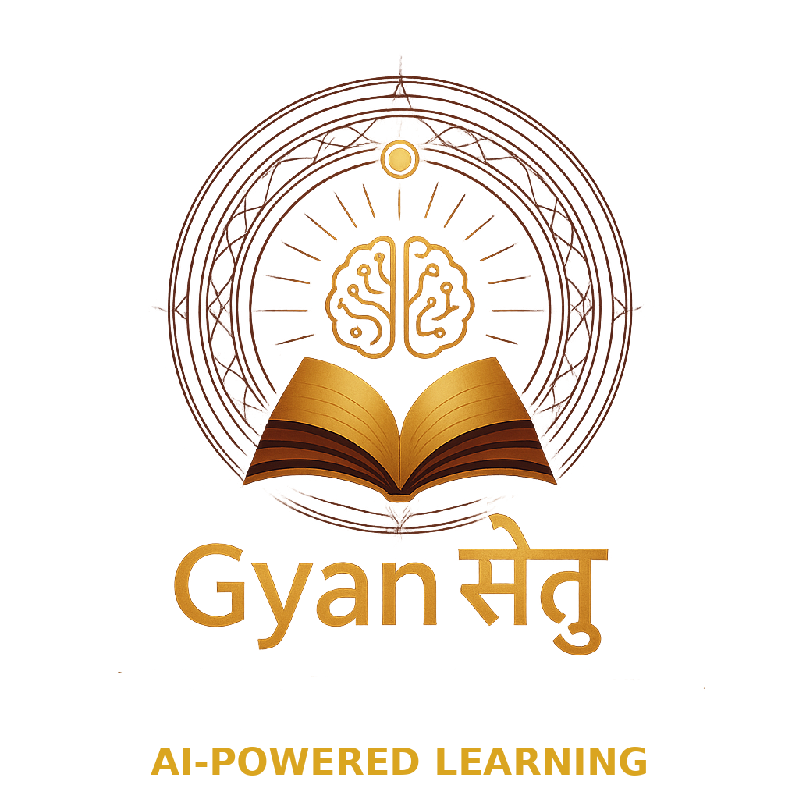

# 📘 GnyanSetu – AI-Powered Interactive Learning Platform

<div align="center">



<br/><br/>


[](LICENSE)
[](https://www.python.org/)
[](https://www.djangoproject.com/)
[](https://reactjs.org/)
[](https://www.mongodb.com/)

**Transform static educational content into dynamic, AI-powered interactive lessons**

[Features](#-features) • [Tech Stack](#-tech-stack) • [Getting Started](#-getting-started) • [Architecture](#-architecture) • [API Documentation](#-api-documentation)

</div>

---

## 🌟 Overview

**GnyanSetu** (Bridge to Knowledge) is an advanced AI-powered learning platform that revolutionizes education by converting static study materials into interactive, personalized learning experiences. The platform combines cutting-edge AI technology with real-time visualization and adaptive learning mechanisms.

### What Makes GnyanSetu Different?

- 🎯 **Interactive AI Teaching** - Not just content, but a virtual teacher that explains step-by-step
- 🎨 **Visual Learning** - Dynamic whiteboard with animations, diagrams, and real-time drawing
- 🧠 **Smart Assessment** - AI-generated quizzes that adapt to your learning pace
- 📝 **Intelligent Notes** - Auto-generated, organized notes with key concepts highlighted
- 🔄 **Real-time Interaction** - WebSocket-powered live learning experience
- 📊 **Progress Tracking** - Comprehensive analytics to monitor learning journey

---

## ✨ Features

### 🎓 Core Learning Features

#### 1. **PDF Upload & Processing**
- Drag-and-drop interface for easy file upload
- Supports PDFs up to 50MB
- Intelligent text extraction with PyMuPDF
- OCR support for scanned documents
- Automatic content structuring

#### 2. **AI-Powered Lesson Generation**
- **Google Gemini AI** integration for content analysis
- Breaks complex topics into digestible steps
- Context-aware explanations
- Adaptive difficulty levels
- Multi-format content support (PDF, text, images)

#### 3. **Interactive Whiteboard Teaching**
- **Real-time Canvas Rendering** with Konva.js
- Dynamic text animation (typewriter effect)
- Shape drawing (rectangles, circles, arrows, lines)
- Color-coded elements for better understanding
- Step-by-step progression with visual cues
- Fullscreen mode for immersive learning
- Export whiteboard content as images

#### 4. **AI-Generated Quizzes** 🚧 *(In Development)*
- **Automatic Question Generation** from lesson content
- Multiple question types:
  - Multiple Choice Questions (MCQs)
  - True/False statements
  - Fill in the blanks
  - Short answer questions
  - Match the following
- **Instant Feedback** with detailed explanations
- **Difficulty Adaptation** based on performance
- **Score Tracking** and performance analytics
- **Time-bound quizzes** with progress indicators
- **Question bank** management for review

#### 5. **Smart Notes System** 📝 *(In Development)*
- **AI-Generated Summaries** of lessons
- **Key Points Extraction** with importance ranking
- **Concept Mapping** and relationship visualization
- **Downloadable PDF** with formatted content
- **Searchable Database** of all notes
- **Highlighting and Annotations** support
- **Version Control** for note updates
- **Collaborative Notes** sharing (planned)
- **Mind Map Generation** from topics

### 🔒 User Management & Authentication

- **Google OAuth 2.0** - One-click sign-in
- **Traditional Auth** - Email/password with JWT tokens
- **Secure Sessions** - Token-based authentication
- **User Profiles** - Personalized dashboards
- **Progress Tracking** - Individual learning history
- **Multi-device Sync** - Learn anywhere, anytime

### 🛠️ Technical Features

- **Microservices Architecture** - Scalable and maintainable
- **API Gateway** - Centralized routing (Port 8000)
- **WebSocket Support** - Real-time bidirectional communication
- **MongoDB Integration** - Flexible document storage
- **RESTful APIs** - Standard API design
- **CORS Enabled** - Cross-origin resource sharing
- **Error Handling** - Comprehensive error management
- **Logging System** - Detailed application logs
- **Load Balancing** - Distributed request handling

---

## 🛠️ Tech Stack

### Backend Services

| Service | Technology | Port | Purpose |
|---------|-----------|------|---------|
| **API Gateway** | Flask 2.3 | 8000 | Request routing, load balancing |
| **User Service** | Django 4.2 + DRF | 8002 | Authentication, user management |
| **Lesson Service** | Django 4.2 + DRF | 8003 | PDF processing, AI lesson generation |
| **Teaching Service** | Django 4.2 + Channels | 8004 | WebSocket, real-time teaching |
| **Quiz Service** | FastAPI *(Planned)* | 8005 | Quiz generation and management |
| **Notes Service** | FastAPI *(Planned)* | 8006 | Notes generation and storage |

### Core Technologies

#### Backend
- **Django 4.2.16** - Web framework with ORM
- **Django REST Framework** - RESTful API development
- **Channels & Daphne** - WebSocket and ASGI server
- **Flask 2.3** - Lightweight API gateway
- **FastAPI** *(Planned)* - Modern, fast API framework for Quiz/Notes services

#### AI & ML
- **Google Generative AI (Gemini Pro)** - Content generation and analysis
- **LangChain** - AI orchestration and prompt management
- **OpenAI API** - Alternative AI model support

#### Database & Caching
- **MongoDB 4.4+** - Primary NoSQL database
- **Motor** - Async MongoDB driver
- **PyMongo** - Sync MongoDB driver
- **Redis** - Caching and session storage
- **Celery** - Distributed task queue

#### Frontend
- **React 18** - Component-based UI library
- **Tailwind CSS 3** - Utility-first styling
- **Framer Motion** - Smooth animations
- **Konva.js** - Canvas rendering for whiteboard
- **jsPDF** - Client-side PDF generation
- **Lucide React** - Modern icon library
- **Axios** - HTTP client

#### Development & DevOps
- **Git** - Version control
- **Docker** *(Planned)* - Containerization
- **Nginx** *(Planned)* - Reverse proxy
- **pytest** - Testing framework
- **ESLint** - JavaScript linting
- **Black** - Python code formatting

---

## 📁 Project Architecture

### Directory Structure

```
GnyanSetu/
│
├── microservices/              # Backend microservices
│   │
│   ├── api-gateway/           # Port 8000 - Flask API Gateway
│   │   ├── app.py            # Main gateway application
│   │   ├── config.py         # Service registry configuration
│   │   ├── requirements.txt  # Gateway dependencies
│   │   └── README.md         # Gateway documentation
│   │
│   ├── user-service-django/  # Port 8002 - User Management
│   │   ├── accounts/         # User authentication app
│   │   │   ├── models.py    # User models
│   │   │   ├── views.py     # Auth endpoints
│   │   │   ├── serializers.py # DRF serializers
│   │   │   └── urls.py      # URL routing
│   │   ├── manage.py         # Django management
│   │   ├── settings.py       # Django configuration
│   │   ├── requirements.txt  # Service dependencies
│   │   └── .env.example      # Environment variables template
│   │
│   ├── lesson-service/       # Port 8003 - Lesson Generation
│   │   ├── lessons/          # Lesson app
│   │   │   ├── views.py     # API endpoints
│   │   │   ├── models.py    # Lesson models
│   │   │   └── ai_engine.py # AI lesson generator
│   │   ├── pdf_processor/    # PDF extraction module
│   │   ├── manage.py
│   │   ├── requirements.txt
│   │   └── celery_config.py  # Async task configuration
│   │
│   ├── teaching-service/     # Port 8004 - Real-time Teaching
│   │   ├── teaching/         # Teaching app
│   │   │   ├── consumers.py # WebSocket consumers
│   │   │   ├── views.py     # API endpoints
│   │   │   ├── models.py    # Teaching models
│   │   │   └── routing.py   # WebSocket routing
│   │   ├── manage.py
│   │   └── requirements.txt
│   │
│   ├── quiz-service/         # Port 8005 - Quiz Management (Planned)
│   │   ├── main.py          # FastAPI application
│   │   ├── models.py        # Pydantic models
│   │   ├── quiz_generator.py # AI quiz generation
│   │   ├── routes/          # API routes
│   │   └── requirements.txt
│   │
│   ├── notes-service/        # Port 8006 - Notes Generation (Planned)
│   │   ├── main.py          # FastAPI application
│   │   ├── models.py        # Pydantic models
│   │   ├── notes_generator.py # AI notes generation
│   │   ├── pdf_export.py    # PDF export functionality
│   │   └── requirements.txt
│   │
│   ├── requirements.txt      # Microservices dependencies
│   ├── start_project.bat     # All services startup script
│   └── logs/                 # Service logs directory
│
├── virtual_teacher_project/   # Legacy Django Project
│   ├── teacher_app/          # Core teaching application
│   │   ├── views.py          # API endpoints
│   │   ├── consumers.py      # WebSocket handlers
│   │   ├── models.py         # Django models
│   │   ├── mongo.py          # MongoDB integration
│   │   └── urls.py           # URL routing
│   │
│   ├── UI/                   # Frontend applications
│   │   │
│   │   ├── landing_page/     # Landing & Auth (Port 3000)
│   │   │   ├── src/
│   │   │   │   ├── App.jsx   # Main landing component
│   │   │   │   ├── components/
│   │   │   │   │   ├── Hero.jsx
│   │   │   │   │   ├── Features.jsx
│   │   │   │   │   ├── LoginModal.jsx
│   │   │   │   │   └── SignupModal.jsx
│   │   │   │   └── index.js
│   │   │   ├── public/
│   │   │   ├── package.json
│   │   │   └── tailwind.config.js
│   │   │
│   │   └── Dashboard/        # Main Dashboard (Port 3001)
│   │       └── Dashboard/
│   │           ├── src/
│   │           │   ├── App.jsx
│   │           │   ├── components/
│   │           │   │   ├── Whiteboard.jsx      # Interactive canvas
│   │           │   │   ├── TeachingCanvas.jsx  # Drawing engine
│   │           │   │   ├── UploadBox.jsx       # PDF upload
│   │           │   │   ├── Quiz.jsx            # Quiz component
│   │           │   │   ├── Notes.jsx           # Notes viewer
│   │           │   │   ├── ChatHistory.jsx     # Conversation history
│   │           │   │   └── SessionManager.jsx  # State management
│   │           │   ├── utils/
│   │           │   │   ├── api.js             # API client
│   │           │   │   └── websocket.js       # WebSocket client
│   │           │   └── index.js
│   │           ├── public/
│   │           ├── package.json
│   │           └── tailwind.config.js
│   │
│   ├── virtual_teacher_project/ # Django project settings
│   │   ├── settings.py       # Configuration
│   │   ├── urls.py           # Main URL routing
│   │   ├── asgi.py           # ASGI application
│   │   └── wsgi.py           # WSGI application
│   │
│   ├── manage.py
│   ├── requirements.txt
│   └── .env.example
│
├── requirements.txt          # Consolidated project dependencies
├── .gitignore               # Git ignore rules
├── .env.example             # Environment variables template
├── README.md                # This file
├── LICENSE                  # MIT License
├── CONTRIBUTING.md          # Contribution guidelines
└── docker-compose.yml       # Docker configuration (Planned)
```

### System Architecture

```
┌──────────────────────────────────────────────────────┐
│                   Client Layer                        │
│  ┌────────────────┐         ┌────────────────┐      │
│  │  Landing Page  │         │   Dashboard    │       │
│  │  (Port 3000)   │         │  (Port 3001)   │       │
│  │  - Auth UI     │         │  - Whiteboard  │       │
│  │  - Google OAuth│         │  - Quiz UI     │       │
│  └────────┬───────┘         └───────┬────────┘       │
└───────────┼─────────────────────────┼────────────────┘
            │                         │
            ▼                         ▼
┌──────────────────────────────────────────────────────┐
│              API Gateway (Port 8000)                  │
│  - Request Routing                                    │
│  - Load Balancing                                     │
│  - Service Discovery                                  │
│  - Health Checks                                      │
└──────────────────┬───────────────────────────────────┘
                   │
        ┌──────────┼──────────┬──────────┬──────────┐
        ▼          ▼          ▼          ▼          ▼
┌─────────────┐ ┌────────┐ ┌────────┐ ┌──────┐ ┌──────┐
│User Service │ │Lesson  │ │Teaching│ │Quiz  │ │Notes │
│(Port 8002)  │ │Service │ │Service │ │Svc   │ │ Svc  │
│             │ │(8003)  │ │(8004)  │ │(8005)│ │(8006)│
│- Auth       │ │        │ │        │ │      │ │      │
│- Google     │ │- PDF   │ │- WS    │ │- Gen │ │- Gen │
│  OAuth      │ │  Upload│ │- Real  │ │- Eval│ │- PDF │
│- JWT        │ │- AI Gen│ │  time  │ │      │ │      │
│- Users CRUD │ │- Store │ │- Teach │ │      │ │      │
└──────┬──────┘ └───┬────┘ └───┬────┘ └───┬──┘ └───┬──┘
       │            │          │          │        │
       └────────────┴──────────┴──────────┴────────┘
                            │
                            ▼
               ┌────────────────────────┐
               │      MongoDB           │
               │  - users               │
               │  - lessons             │
               │  - conversations       │
               │  - quizzes             │
               │  - notes               │
               │  - progress            │
               └────────────────────────┘
                            │
               ┌────────────┴────────────┐
               │                         │
               ▼                         ▼
        ┌─────────────┐        ┌──────────────┐
        │   Redis     │        │  Celery      │
        │   Cache     │        │  Task Queue  │
        └─────────────┘        └──────────────┘
```

---

## 🚀 Getting Started

### Prerequisites

Ensure you have the following installed:

- **Python 3.8+** - [Download](https://www.python.org/downloads/)
- **Node.js 16+** - [Download](https://nodejs.org/)
- **MongoDB 4.4+** - [Download](https://www.mongodb.com/try/download/community)
- **Git** - [Download](https://git-scm.com/downloads/)
- **Google API Key** - [Get Key](https://makersuite.google.com/app/apikey)

### Quick Start (Windows - Recommended)

```batch
# 1. Clone the repository
git clone https://github.com/AaryaKhatate/GnyanSetu.git
cd GnyanSetu

# 2. Run the automated startup script
cd microservices
start_project.bat
```

This will automatically:
- ✅ Install all Python dependencies
- ✅ Install all Node.js dependencies  
- ✅ Start MongoDB
- ✅ Start all microservices (Ports 8000-8004)
- ✅ Start React applications (Ports 3000, 3001)
- ✅ Open browser to landing page

### Manual Setup

#### Step 1: Clone Repository

```bash
git clone https://github.com/AaryaKhatate/GnyanSetu.git
cd GnyanSetu
```

#### Step 2: Backend Setup

```bash
# Create and activate virtual environment
python -m venv venv

# Windows
venv\Scripts\activate

# Linux/Mac
source venv/bin/activate

# Install dependencies
pip install -r requirements.txt
```

#### Step 3: Configure Environment

Create `.env` files in each service directory:

**microservices/user-service-django/.env**
```env
SECRET_KEY=your-django-secret-key-here
DEBUG=True
MONGODB_URI=mongodb://localhost:27017/gnyansetu
GOOGLE_CLIENT_ID=your-google-client-id
GOOGLE_CLIENT_SECRET=your-google-client-secret
JWT_SECRET_KEY=your-jwt-secret-key
```

**microservices/lesson-service/.env**
```env
GOOGLE_API_KEY=your-gemini-api-key
MONGODB_URI=mongodb://localhost:27017/gnyansetu
CELERY_BROKER_URL=redis://localhost:6379/0
```

**microservices/teaching-service/.env**
```env
MONGODB_URI=mongodb://localhost:27017/gnyansetu
REDIS_URL=redis://localhost:6379/1
```

#### Step 4: Start Services

Open **4 separate terminals**:

```bash
# Terminal 1 - API Gateway (Port 8000)
cd microservices/api-gateway
python app.py

# Terminal 2 - User Service (Port 8002)
cd microservices/user-service-django
python manage.py runserver 8002

# Terminal 3 - Lesson Service (Port 8003)
cd microservices/lesson-service
python manage.py runserver 8003

# Terminal 4 - Teaching Service (Port 8004)
cd microservices/teaching-service
daphne -b 0.0.0.0 -p 8004 teaching_service.asgi:application
```

#### Step 5: Start Frontend

Open **2 more terminals**:

```bash
# Terminal 5 - Landing Page (Port 3000)
cd virtual_teacher_project/UI/landing_page/landing_page
npm install
npm start

# Terminal 6 - Dashboard (Port 3001)
cd virtual_teacher_project/UI/Dashboard/Dashboard
npm install
set PORT=3001 && npm start  # Windows
PORT=3001 npm start          # Linux/Mac
```

#### Step 6: Access Application

- 🌐 **Landing Page**: http://localhost:3000
- 📊 **Dashboard**: http://localhost:3001  
- 🔧 **API Gateway**: http://localhost:8000/health

---

## 📚 API Documentation

### Authentication Endpoints

#### User Service (Port 8002)

| Method | Endpoint | Description | Request Body |
|--------|----------|-------------|--------------|
| POST | `/api/v1/auth/signup/` | Register new user | `{full_name, email, password, password_confirm, username}` |
| POST | `/api/v1/auth/login/` | User login | `{email, password}` |
| POST | `/api/v1/auth/logout/` | User logout | - |
| POST | `/api/v1/auth/google/` | Google OAuth login | `{credential}` |
| GET | `/api/v1/users/profile/` | Get user profile | Headers: `Authorization: Bearer <token>` |
| PUT | `/api/v1/users/profile/` | Update profile | `{full_name, email}` |
| GET | `/api/v1/health/` | Health check | - |

### Lesson Management

#### Lesson Service (Port 8003)

| Method | Endpoint | Description | Request Body |
|--------|----------|-------------|--------------|
| POST | `/api/upload/` | Upload PDF file | FormData: `{file: <pdf>}` |
| POST | `/api/generate-lesson/` | Generate AI lesson | `{topic, pdf_text, difficulty}` |
| GET | `/api/lessons/` | Get all lessons | Query: `?user_id=<id>` |
| GET | `/api/lessons/<id>/` | Get specific lesson | - |
| DELETE | `/api/lessons/<id>/` | Delete lesson | - |
| GET | `/health` | Health check | - |

### Real-time Teaching

#### Teaching Service (Port 8004)

| Method | Endpoint | Description | Request Body |
|--------|----------|-------------|--------------|
| GET | `/api/conversations/` | Get conversations | Query: `?user_id=<id>` |
| POST | `/api/conversations/create/` | Create conversation | `{user_id, lesson_id, topic}` |
| DELETE | `/api/conversations/<id>/` | Delete conversation | - |
| GET | `/api/teaching/<session_id>/` | Get teaching session | - |
| WS | `/ws/teaching/<session_id>/` | WebSocket connection | - |
| GET | `/health` | Health check | - |

### Quiz System (Planned - Port 8005)

| Method | Endpoint | Description | Request Body |
|--------|----------|-------------|--------------|
| POST | `/api/quizzes/generate/` | Generate quiz | `{lesson_id, question_count, difficulty}` |
| GET | `/api/quizzes/<lesson_id>/` | Get quizzes | - |
| POST | `/api/quizzes/<quiz_id>/submit/` | Submit answers | `{answers: [{question_id, answer}]}` |
| GET | `/api/quizzes/<quiz_id>/results/` | Get quiz results | - |
| GET | `/api/quizzes/<quiz_id>/review/` | Review quiz with answers | - |

### Notes System (Planned - Port 8006)

| Method | Endpoint | Description | Request Body |
|--------|----------|-------------|--------------|
| POST | `/api/notes/generate/` | Generate notes | `{lesson_id, format, detail_level}` |
| GET | `/api/notes/<lesson_id>/` | Get notes | - |
| GET | `/api/notes/<note_id>/download/` | Download as PDF | Query: `?format=pdf` |
| PUT | `/api/notes/<note_id>/` | Update notes | `{content, highlights}` |
| POST | `/api/notes/<note_id>/export/` | Export notes | `{format: 'pdf'|'markdown'|'html'}` |

### WebSocket Protocol

**Connection URL**: `ws://localhost:8004/ws/teaching/<session_id>/`

**Client → Server Messages**:

```javascript
// Start lesson
{
  "type": "start_lesson",
  "lesson_id": "12345",
  "user_id": "user_abc"
}

// Request next step
{
  "type": "next_step"
}

// Pause lesson
{
  "type": "pause"
}
```

**Server → Client Messages**:

```javascript
// Lesson step
{
  "type": "step",
  "step": 1,
  "total_steps": 10,
  "speech_text": "Let's learn about...",
  "drawing_commands": [
    {
      "type": "text",
      "text": "Hello World",
      "x": 100,
      "y": 50,
      "fontSize": 24,
      "color": "#000000"
    }
  ]
}

// Lesson complete
{
  "type": "lesson_complete",
  "quiz_available": true,
  "notes_available": true
}
```

---

## 🎯 Roadmap

### ✅ Phase 1: Core Platform (Completed)
- [x] Microservices architecture
- [x] PDF upload and processing
- [x] AI lesson generation with Gemini
- [x] Real-time whiteboard with WebSocket
- [x] User authentication (Google OAuth + JWT)
- [x] Interactive teaching canvas
- [x] Landing page and dashboard

### 🚧 Phase 2: Quiz System (In Progress)
- [ ] AI-powered quiz generation from lessons
- [ ] Multiple question type support
- [ ] Instant feedback mechanism
- [ ] Score tracking and analytics
- [ ] Adaptive difficulty system
- [ ] Question bank management
- [ ] Quiz review with explanations
- [ ] Performance insights dashboard

### 📋 Phase 3: Notes System (Planned - Q1 2026)
- [ ] AI-generated summary notes
- [ ] Key points extraction
- [ ] Concept mapping visualization
- [ ] PDF export with formatting
- [ ] Markdown export support
- [ ] Search functionality
- [ ] Note annotations and highlights
- [ ] Version control for notes
- [ ] Collaborative notes sharing

### 🚀 Phase 4: Advanced Features (Q2 2026)
- [ ] Mobile application (React Native)
- [ ] Offline mode support
- [ ] Video integration
- [ ] Voice commands for navigation
- [ ] Advanced analytics dashboard
- [ ] Gamification elements
- [ ] Leaderboards and achievements
- [ ] Discussion forums
- [ ] Study groups and collaboration
- [ ] Multi-language support
- [ ] Custom lesson templates
- [ ] Admin dashboard

### 🌐 Phase 5: Scale & Performance (Q3 2026)
- [ ] Docker containerization
- [ ] Kubernetes orchestration
- [ ] CDN integration
- [ ] Database optimization
- [ ] Caching layer enhancement
- [ ] Load testing and optimization
- [ ] Security audits
- [ ] GDPR compliance
- [ ] Accessibility improvements (WCAG 2.1)

---

## 🤝 Contributing

We welcome contributions from the community! Here's how you can help:

### Getting Started

1. **Fork the repository**
2. **Clone your fork**: `git clone https://github.com/YOUR_USERNAME/GnyanSetu.git`
3. **Create a branch**: `git checkout -b feature/AmazingFeature`
4. **Make your changes**
5. **Commit**: `git commit -m 'Add some AmazingFeature'`
6. **Push**: `git push origin feature/AmazingFeature`
7. **Open a Pull Request**

### Development Guidelines

- Follow **PEP 8** for Python code
- Use **ESLint** for JavaScript/React code
- Write **meaningful commit messages**
- Add **tests** for new features
- Update **documentation**
- Keep **code DRY** (Don't Repeat Yourself)

### Code Review Process

1. All submissions require review
2. Changes must pass CI/CD checks
3. Maintain test coverage above 80%
4. Follow existing code patterns

---

## 📝 License

This project is licensed under the MIT License - see the [LICENSE](LICENSE) file for details.

---

## 👥 Team

### Core Contributors

- **Aarya Khatate** - Project Lead & Full Stack Developer
  - GitHub: [@AaryaKhatate](https://github.com/AaryaKhatate)
  - Email: aryakhatate@gmail.com

- **Vinay Gone** - Backend Developer
  - GitHub: [@VinayGone2006](https://github.com/VinayGone2006)

- **Yashraj Patil** - Frontend Developer
  - GitHub: [@Yashrajpatil22](https://github.com/Yashrajpatil22)

### Contributors

See [CONTRIBUTORS.md](CONTRIBUTORS.md) for the full list of contributors.

---

## 📧 Contact & Support

- **Email**: aryakhatate@gmail.com
- **GitHub Issues**: [Report Bug](https://github.com/AaryaKhatate/GnyanSetu/issues)
- **Feature Requests**: [Request Feature](https://github.com/AaryaKhatate/GnyanSetu/issues/new?labels=enhancement)
- **Discussions**: [GitHub Discussions](https://github.com/AaryaKhatate/GnyanSetu/discussions)

---

## 🙏 Acknowledgments

- **Google Gemini AI** - Advanced language model for content generation
- **OpenAI** - GPT models and research
- **MongoDB** - Flexible database solutions
- **React Community** - UI framework and ecosystem
- **Django Community** - Web framework and tools
- **All Contributors** - Thank you for your support!

---

## 📊 Project Stats


---

<div align="center">

**Made with ❤️ for Education**

**GnyanSetu** - Building Bridges to Knowledge

⭐ Star this repository if you find it helpful!

[Report Bug](https://github.com/AaryaKhatate/GnyanSetu/issues) • [Request Feature](https://github.com/AaryaKhatate/GnyanSetu/issues/new?labels=enhancement) • [Contribute](CONTRIBUTING.md)

</div>
